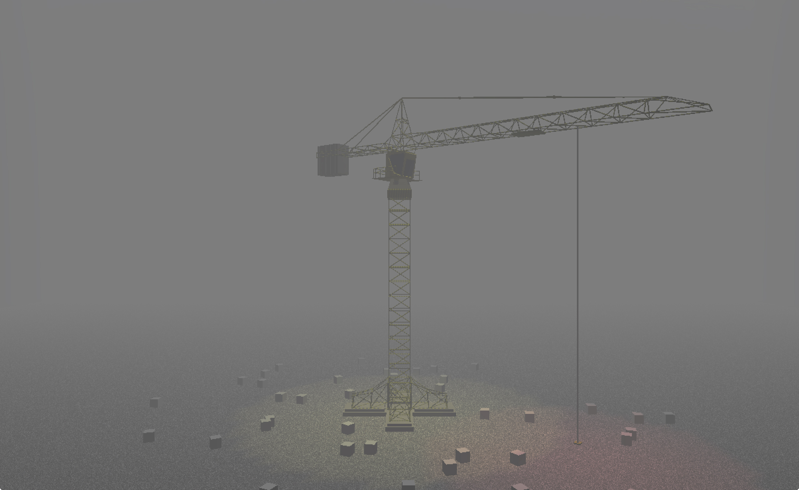

# OpenGL crane

Small working crane made in Java and OpenGL as a small school project (semestral work) at Faculty of Informatics, Masaryk University. The purpose of the project was to learn basics of OpenGL.

## Controls

- *WSAD* - moving the camera
- *UP/DOWN* - move the magnet forwards/backwards
- *LEFT/RIGHT* - rotate the crane
- *U/J* - move the magnet up/down
- *SPACE* - turn the magnet on/off
- *C* - change the camera

## Screenshot

## Links

- https://is.muni.cz/predmet/fi/jaro2014/PV112?lang=en
- http://www.fi.muni.cz/~xkozlik/PV112/